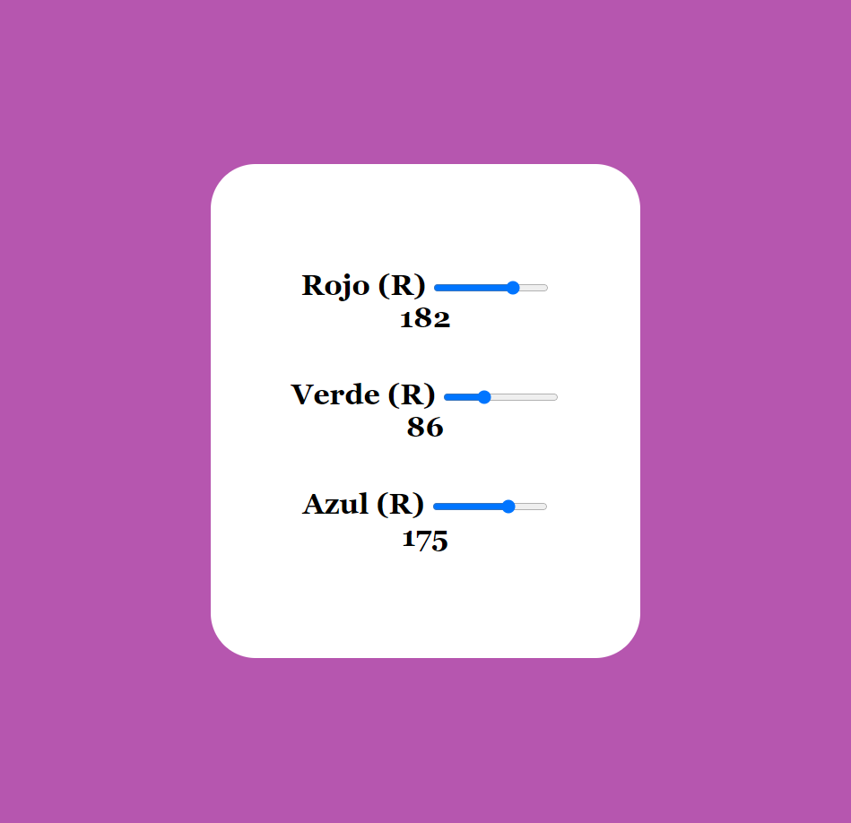

# Cambio el color de fondo con un color RGB

Escucha los eventos de los elementos input de HTML para extraer sus valores y usuarios para modificación del objetos en el DOM. en este caso el style del body.

